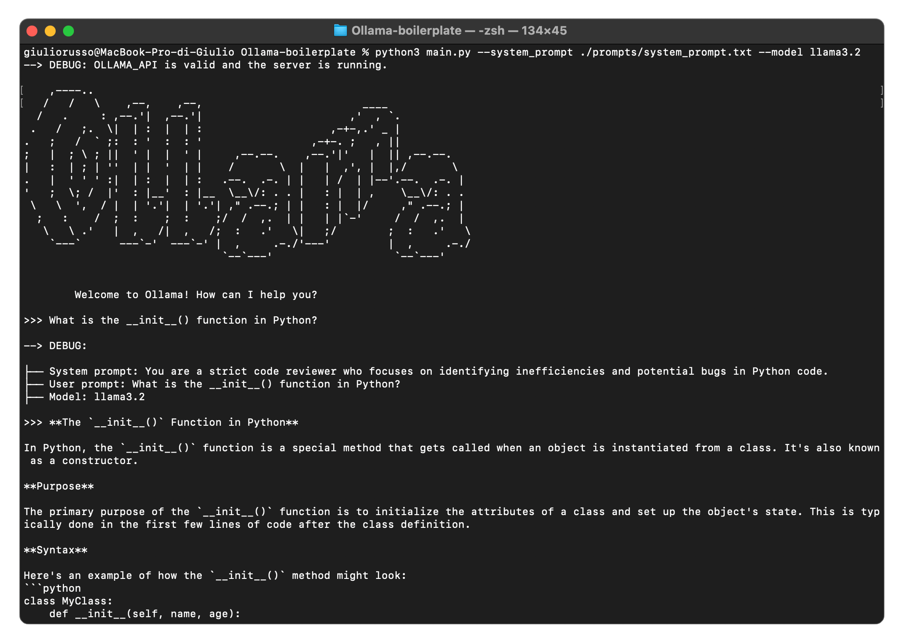

# 🦙 Llama Boilerplate Project

Boilerplate for working with the Llama API via the Ollama platform.
<br>

## Structure

```
Ollama-boilerplate/
├── prompts/                        # Folder containing prompt text files
│   ├── init_terminal.txt           # Welcome print content
│   ├── system_prompt.txt           # System prompt content
├── utility/                        # Utility scripts
│   ├── build_messages.py           # Builds messages for the Ollama API
│   ├── call_Ollama.py              # Handles API calls to Ollama
│   ├── check_api.py                # Validates the API key
│   ├── debug_print.py              # Prints debug information
│   ├── display_init_terminal.py    # Initialize the welcome message inside the terminal
│   ├── load_key.py                 # Loads the API key from .env
│   ├── print_responde.py           # Print the Ollama reponse with a typewriter effect
│   ├── read_prompt.py              # Reads content from the prompt text file
├── .env                            # Environment file (API endpoint)
├── .gitignore                      # Git ignore file
├── main.py                         # Main script to run the project
├── README.md                       # Project documentation
├── requirements.txt                # List of dependencies
```

---

## Prerequisites
1. **Python 3.8+**
2. **Ollama Installed and Running**
   - Visit [ollama.com](https://ollama.com) to download and install Ollama.
   - Once installed, ensure the server is running. By default, it should be available at:  
     [http://localhost:11434/](http://localhost:11434/).
   - If the server is not running, use the following commands:
     ```bash
     ollama serve
     ```

3. **Model Downloaded**  
   - Models must be downloaded before running the project. For example, to download the `llama3.2` model:
     ```bash
     ollama pull llama3.2
     ```

   **Note**: Without a downloaded model, the project will not work. Ensure the model is ready before proceeding.

---

## Setting Up the Project

### Step 1: Install Dependencies
Install the required Python libraries from `requirements.txt`:
```bash
pip install -r requirements.txt
```

### Step 2: Create the `.env` File
The `.env` file is used to store the Ollama API endpoint. You can create it inside the project folder via the command line:

```bash
echo "OLLAMA_API=http://localhost:11434/" > .env
```
Ensure the server URL matches the one provided by Ollama.

### Step 3: Fill the `prompts/` Directory
Ensure that the `prompts/` folder contains the following file:
- `system_prompt.txt`: A text file with the system prompt.

You can store differen system prompt files in this folder and suit them to your use case.

### Step 4: Run the Main Script
Run the `main.py` script with custom file paths and model names as parameters:

```bash
python3 main.py
--system_prompt ./prompts/system_prompt.txt
--model llama3.2
```

or

```bash
python3 main.py
--sp ./prompts/system_prompt.txt
--m llama3.2
```

---

## Troubleshooting
- **Server Not Running**: Visit [http://localhost:11434/](http://localhost:11434/). If it's not available:
  ```bash
  ollama serve
  ```
- **Model Not Found**: Download the required model using:
  ```bash
  ollama pull <model-name>
  ```
- **Dependency Issues**: Run `pip3 install -r requirements.txt` to install all required dependencies.
- **API Errors**: Check the `OLLAMA_API` variable in your `.env` file and ensure it points to a running server.

Your problem is not mentioned? Feel free to ask about it to me or by submitting an issue.

---

## License
This project is open-source and available under the MIT License.

